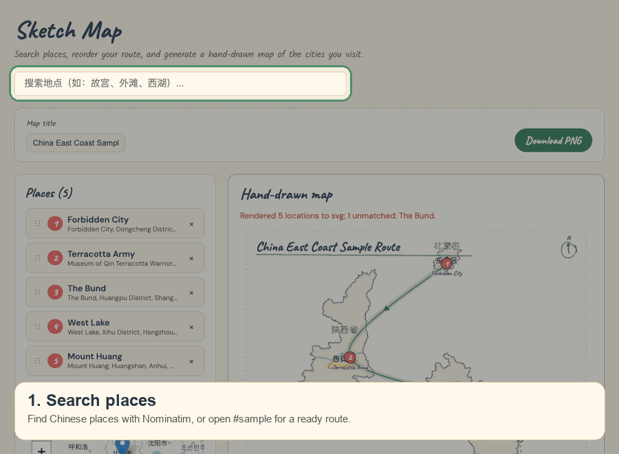

# sketch-map-app

Vite + React SPA for building hand-drawn China travel-route maps. Uses [`sketch-map-sdk`](https://www.npmjs.com/package/sketch-map-sdk) as the render engine.



## Live demo (GitHub Pages)

A build of this app is published on GitHub Pages as the **[live site](https://dcheng666666.github.io/sketch-map-app/)**. To load the bundled example route without searching, open **[sample route](https://dcheng666666.github.io/sketch-map-app/#sample)**. Deployments run from GitHub Actions after the **CI** workflow succeeds on `main` (see [`.github/workflows/deploy.yml`](./.github/workflows/deploy.yml)).

## Prerequisites

- Node 20+
- pnpm 10.23.0 (see `packageManager` in `package.json`)

## Commands

```bash
pnpm install
pnpm dev
pnpm lint
pnpm build
```

Open the dev server URL; add `#sample` to load the bundled sample route:

```bash
pnpm dev
# then open http://localhost:5173/#sample
```

## Usage Flow

1. Search for a Chinese place, such as `故宫`, `外滩`, or `西湖`.
2. Select a search result to add it to the route.
3. Repeat the search to add more stops. The order in the Places list controls the route order and marker numbers.
4. Drag places in the Places list to reorder the route, or remove places you no longer need.
5. Edit the map title in the toolbar.
6. Check the live hand-drawn preview. If a location cannot match the bundled China map data, the app shows an error or partial-render message.
7. Click **Download PNG** to export the final route map.
